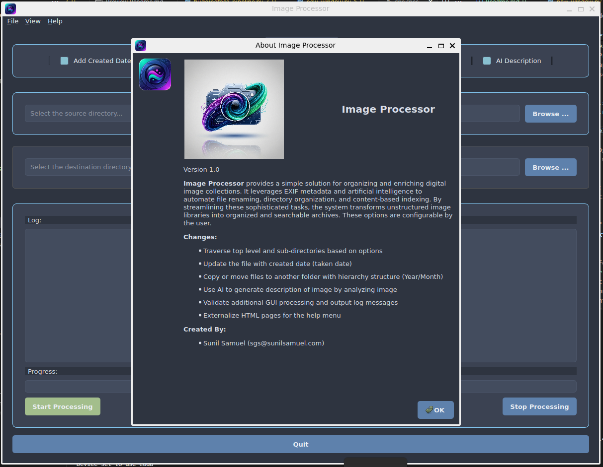

<p align='right'>
	<small>Sunil Samuel<br>
		web_github@sunilsamuel.com<br>
		http://www.sunilsamuel.com
	</small>
</p>

# Intelligent Image Archiving 🖼️

This application provides a simple solution for organizing and enriching digital image collections. It leverages EXIF metadata and artificial intelligence to automate file renaming, directory organization, and content-based indexing. By streamlining these sophisticated tasks, the system transforms unstructured image libraries into organized and searchable archives.  The application uses AI models to dynamically generate a description for each image.  These options are configurable by the user.

## Automatic Renaming 📅
The app checks each photo's metadata (EXIF) to find the exact date it was taken. It then automatically renames the file to include that date. This changes a generic name like IMG_4821.jpg into a clear, chronological one, instantly organizing your files by date.

## AI-Powered Descriptions 🤖
It uses artificial intelligence to analyze the contents of your pictures. The AI identifies objects, scenes, and actions and then generates a short text description. This description is saved directly into the image file's UserComment field, which makes your photos searchable using keywords.

## Tidy Folder Structure 📂

Finally, the tool sorts your photos into folders based on the year and month they were taken. This neatly organizes your entire collection into a clean directory structure, making it much easier to browse, manage, and back up your images.

## Installation ⚙️

The application is simple enough that following steps should get you running:

### Python Virtual Environment (venv) 💡

1. Create a virtual environment (This is not required, but it helps to separate out other environments and requirements)
    * > `cd /directory/to/my/venvs`
    * > `python -m venv exif_image_processing`
    * > `/directory/to/my/venvs/exif_image_processing/bin/activate` (or activate.csh, Activate.ps1, ...)
1. Install the following modules:
    * > `pip install PySide6 piexif transformers==4.49.0 Pillow pywin32 huggingface_hub keyring timm einops "huggingface_hub[hf_xet]"`
    * > `pip install torch torchvision torchaudio --index-url https://download.pytorch.org/whl/cu121`

1. Install keyring on some systems, such as Ubuntu.  If you are running this on Windows, then you should not need to install the keyring applicaiton
    * > `sudo apt-get update`
    * > `sudo apt-get install gnome-keyring`
1. Execute the `app.py`
    * > `/directory/to/my/venvs/exif_image_processing/bin/python /install_dir/app.py`

> 📝 NOTE: The `transformers==4.49.0` version is required for now since the model `microsoft/Florence-2-large` does not work with the latest.  Eventually, they will fix this and we should be able to use the latest `transformers`.

### Huggingface Token 🤗

In order to use the AI models to generate the dynamic descriptions for the images, you must first create a huggingface token.  Use the following URL to create this token:

`https://huggingface.co/settings/tokens`

Once the token is generated, use `File->Set Huggingface Token` and place this newly created token into the text box. This will persist the token into your personal folder so that the next time you run this application, the token is already set. 

The AI image-to-text pipeline will not work if this is not done.

The application uses the following models to analyze and generate image description:
* `microsoft/Florence-2-large` (https://huggingface.co/microsoft/Florence-2-large/blob/main/sample_inference.ipynb)
* `ydshieh/vit-gpt2-coco-en`
* `Salesforce/blip-image-captioning-base`

> 📝 NOTE: The code stores the huggingface token using keyring so that token is encrypted.  If you are using an operating system that does not have keyring, then please install it.

## Application 💻

The application uses `PySide6` module that provides access to the `Qt` framework.  This framework provides the functionality to create GUI applications that works within different operating systems, such as Linux and Windows.

`https://pypi.org/project/PySide6/`

The application has the following interface.



### Images 🌄

The application uses images for several reasons, such as the main window icon and HTML help text.  These images must be converted to resources for them to work correctly.  Otherwise, the application will not be able to locate them.

The `resources.qrc` file lists all of the images that are used within this application.  The file is as follows:

```xml
<!DOCTYPE RCC>
<RCC version="1.0">
  <qresource prefix="/">
    <!-- These are the images for the application -->
    <file alias="app_icon.jpg">Static/Graphics/Icons/ipa_v4.jpeg</file>
    <file alias="window_icon.png">Static/Graphics/Icons/window_icon_256x256.png</file>
  </qresource>
</RCC>
```

Now, we must compile the resources to a .py file as follows:

```bash
pyside6-rcc -no-compress resources.qrc -o resources_rc.py --verbose
```

This will create a file named `resources_rc.py` that contains the compiled versions of all of the images.  Now, `import` this file into the main application.  See `app.py`.

At this point, we can use the images in the HTML and QIcons as follows:

```html
<html>
    ...
    
    ...
</html>
```

or in the code:

```python
icon: QIcon = QIcon(":/window_icon.png")
```

> 📝 NOTE: Any time you make a change to the stylesheet (`app_stylesheet.qss`), you must recreate the resources file.

### Native Application 💫

The main purpose of using PyInstaller or Nuitka is to package the Python application and all its dependencies into a single, standalone executable file (.exe on Windows). This allows anyone to run your application on their computer, even if they do not have Python installed.  There are several different tools that can be used to compile this application, but I recommend using `Nuitka`.  Here are the pros and cons.

#### Comparison (PyInstaller, Nuitka, and cx_Freeze) 📊

The following is a quick comparision among the different technologies.

|Tool| Final Size | Startup Speed | Ease of Use | Creation Time |Description|
|----|------------|---------------|-------------|---------------|-----------|
|PyInstaller|Very Large|Slow|Very Easy|Quick| Freezes code and bundles Python|
|Nuitka|Smallest|Excellent|Moderate|Extremely Slow|Compiled to C|
|cx_Freeze|Large|Excellent|Moderate|Quick|Freezes code and bundles Python|

`UPX` (https://upx.github.io/) - is an executable packer.  This is used to reduce the size of the DLL and executable.
> 📝 NOTE: Install the [Latest Release](https://github.com/upx/upx/releases/latest) for your operating system.


#### Option 1. Nuitka (Recommended) 📍

Compile using `Nuitka` module (recommended)

My objective is not to go into detail of the workings of `Nuitka`.  You can find more information at: https://nuitka.net/

The following parameters are used to execute `Nuitka`.

* **--standalone** - Creates a distributable folder with all necessary files.
* **--onefile** - Combines everything into a single executable file (similar to PyInstaller).
* **--windows-console-mode=disable** - Essential for GUI apps to prevent a console window from appearing.
* **--enable-plugin=pyside6** - This is the most critical flag. It activates the plugin that correctly finds and bundles all the necessary Qt libraries, plugins, and QML files for PySide6.
* **--upx-binary** - Directory where UPX is installed.  UPX is used to compress the executable.
* **--windows-icon-from-ico** - Sets your application's icon from an .ico file.

1. Install `Nuitka` and its dependencies from terminal.
    > `pip install nuitka`
1. Run the build command
    ```bash
    bash> python -m nuitka --onefile --windows-console-mode=disable \
          --enable-plugin=pyside6 --upx-binary="UPX/5.0.2/upx-5.0.2-win64\upx.exe" \
          --windows-icon-from-ico="application/Static/Graphics/Icons/windows_icon.ico" \
          app.py
    ```

#### Option 2. PyInstaller 📍

This application can be packaged to run as a native executible for your operating system. To compile this application as a native application, follow these steps:

1. Install PyInstaller, if not already available:
    > `pip install pyinstaller`
1. Install tkinter for splash screen, following for your OS:
  * **For Windows (and most Python installations)**
    > `tkinter` is usually included with Python. If it's missing, you may need to modify your Python installation. Go to "Add or remove programs," find your Python version, click "Modify," and ensure that "tcl/tk and IDLE" is checked.
  * **For Debian/Ubuntu/Mint Linux**
    > `sudo apt-get install python3-tk`
  * **For Fedora/CentOS/RHEL Linux**
    > `sudo dnf install python3-tkinter`
  * **For macOS**
    * tkinter is typically included with the standard Python installation from python.org. If you are using a different distribution like Homebrew, you may need to install it separately.
    > `brew install python-tk`
1. Change Directory to the `application` folder
    > `cd application`
1. Open the terminal (either PowerShell, CMD, WSL, ...) and run the following command.  There are two different ways to compile using `pyinstaller`, using the .spec file or complete command parameters.  The .spec file will give more control over the results, such as including the `exclude` section.  Running the application given full command line parameters will create the .spec file that you can use to further control the results.
    ```bash
    bash> pyinstaller --onefile --windowed \
          --icon=application/Static/Graphics/Icons/windows_icon.ico --name="ImageProcessor_v1" \
          --splash=application/Static/Graphics/Icons/ipa_v4_splash.png \
          --upx-dir="UPX/5.0.2/upx-5.0.2-win64" application/app.py
    ```
    ```
    bash> pyinstaller --upx-dir="UPX/5.0.2/upx-5.0.2-win64" ImageProcessor_v1.spec`
    ```

## Development Environment 🛠️

The best IDE for development is `Visual Studio Code`.  Update the IDE as follows.

1. Set the Python interpreter path in Visual Studio Code, follow these steps: 
  * Open the Command Palette:
    * Press `Ctrl+Shift+P` (Windows/Linux) or `Cmd+Shift+P` (macOS).
    * Select Interpreter:
        * Type "**Python: Select Interpreter**" and select the corresponding command from the dropdown list, `Create Virtual Environment...` or `Enter interpreter path...` (if you already created the venv)
1. Install the following extensions (recommended, but optional):
  * Python (Microsoft)
  * Python Debugger (Microsoft)
  * Python Environments (Microsoft)
  * Qt Core (Qt Group)

Once the environment is set, run the `app.py` file as follows:

> Right click on `app.py` and choose `Run Python File in Terminal`

## To Do

* Use the lat/lon information to convert to address using `geopy`